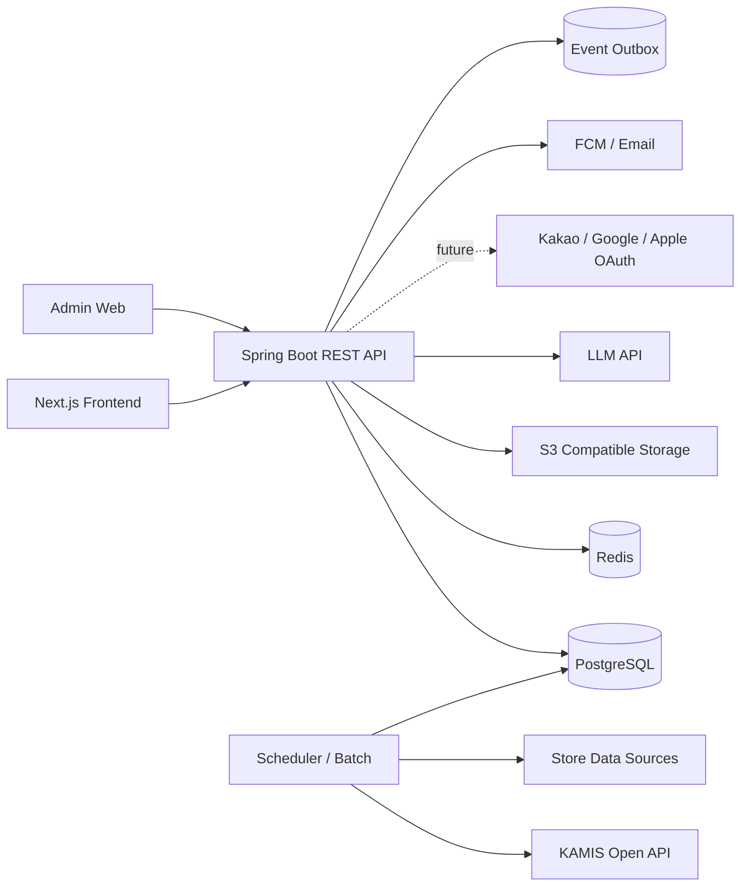
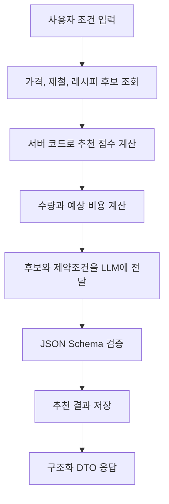

# Backend Architecture

## 1. 설계 방향

초기에는 하나의 Spring Boot 애플리케이션으로 개발합니다. 기능별 패키지를 명확히 분리한 모듈형 모놀리식 구조를 사용합니다.

마이크로서비스를 처음부터 도입하지 않는 이유는 다음과 같습니다.

- 배포, 인증, 트랜잭션, 장애 추적 복잡도를 낮출 수 있습니다.
- Swagger 계약과 도메인 모델을 먼저 안정화할 수 있습니다.
- 추후 배치, 알림, 추천처럼 분리 가치가 큰 영역만 독립 서비스로 이전할 수 있습니다.

## 2. 시스템 구성



## 3. 애플리케이션 패키지

```text
src/main/java/com/seasonaldining/
  common/
    config/
    exception/
    response/
    security/
    event/
    util/

  auth/
  user/
  ingredient/
  season/
  price/
  store/
  recipe/
  reel/
  favorite/
  shopping/
  product/
  seller/
  notification/
  analytics/
  creator/
  promotion/
  settlement/
  admin/

  infrastructure/
    kamis/
    llm/
    storage/
    oauth/
    push/
```

각 도메인은 아래 구조를 기본으로 사용합니다.

```text
ingredient/
  controller/
  service/
  repository/
  entity/
  dto/
    request/
    response/
```

## 4. 외부 데이터 처리

### KAMIS 가격 데이터

```text
매일 새벽 Batch
-> KAMIS API 호출
-> 원본 응답 저장
-> 품목명 표준화
-> 기준 단위 환산
-> 가격 변동률 계산
-> 알림 대상 판별
-> notification 이벤트 발행
```

`무`, `세척무`, `월동무`처럼 이름이 다른 품목은 `ingredient_aliases`를 통해 내부 표준 식재료와 연결합니다.

### 구매처 데이터

구매처 데이터는 공공 평균 가격과 분리합니다.

- 공공 평균 가격: 가격 추세와 구매 적기 판단에 사용
- 온라인 참고 가격: 외부 구매처 이동에 사용
- 오프라인 참고 가격: 지역 기반 구매처 안내에 사용
- 배송비, 쿠폰, 회원 등급, 재고: 별도 안내 항목으로 처리

## 5. AI 추천 처리

AI는 추천 엔진 전체가 아니라 구조화된 설명과 수정 요청 처리에 사용합니다.



추천 점수 기본 가중치는 다음과 같습니다.

```text
가격 메리트 30%
+ 제철성 20%
+ 사용자 조건 적합도 20%
+ 레시피 및 릴스 활용도 15%
+ 구매처 접근성 15%
```

## 6. 비동기 처리

초기에는 DB Outbox 패턴과 스케줄러를 사용합니다.

```text
가격 갱신
-> outbox_events 저장
-> 알림 생성
-> 푸시 발송
-> 실패 시 재시도
```

트래픽 증가 시 Kafka 또는 RabbitMQ로 교체할 수 있습니다.

## 7. 보안과 운영

- MVP는 이메일/비밀번호 로그인 후 JWT access token만 발급합니다.
- Refresh token 재발급, logout token revoke, OAuth는 고도화 단계에서 도입합니다.
- 사용자 위치와 알레르기는 최소 범위만 저장합니다.
- 관리자 API는 별도 권한을 요구합니다.
- 모든 외부 API 호출은 timeout, retry, circuit breaker 정책을 둡니다.
- 응답 오류에는 요청 추적용 `traceId`를 포함합니다.
