# Domains and ERD

## 1. 도메인 목록

| 도메인 | 핵심 역할 |
| --- | --- |
| `auth` | 이메일/비밀번호 로그인, JWT access token. OAuth/refresh token은 future |
| `user` | 프로필, 가구원 수, 취향, 알레르기, 보유 재료 |
| `ingredient` | 표준 식재료, 품목 별칭, 영양 정보 |
| `season` | 월별 및 지역별 제철 정보 |
| `price` | 공공 시세, 가격 이력, 전망, 단위 환산 |
| `store` | 구매처, 상품, 외부 링크, 지역별 참고 가격 |
| `recipe` | 레시피, 재료, 조리 순서, 대체 재료 |
| `reel` | 영상, 크리에이터, 태그, 좋아요, 댓글, 저장 |
| `favorite` | 찜한 식재료와 저장 레시피 |
| `product` | 판매 상품, 상품 상세, 판매자 등록 |
| `notification` | 가격 하락, 제철 시작, 레시피 추천 알림 |
| `analytics` | 검색, 조회, 완주율, 구매처 이동 로그 |
| `creator` | 크리에이터 등록과 콘텐츠 관리 |
| `promotion` | 유통사와 브랜드 프로모션 |
| `settlement` | 제휴 수수료와 크리에이터 정산 |
| `admin` | 큐레이션, 데이터 검수, 신고 처리 |

## 2. 핵심 ERD

```mermaid
erDiagram
    USERS ||--|| USER_PREFERENCES : has
    USERS ||--o{ USER_ALLERGIES : has
    USERS ||--o{ PANTRY_ITEMS : owns
    USERS ||--o{ FAVORITES : creates
    USERS ||--o{ PRICE_ALERTS : configures
    USERS ||--o{ PRODUCTS : sells
    USERS ||--o{ NOTIFICATIONS : receives
    USERS ||--o{ USER_EVENTS : generates

    INGREDIENTS ||--o{ INGREDIENT_ALIASES : maps
    INGREDIENTS ||--o{ SEASONAL_INGREDIENTS : has
    INGREDIENTS ||--o{ PRICE_SNAPSHOTS : priced
    INGREDIENTS ||--o{ STORE_OFFERS : sold
    INGREDIENTS ||--o{ RECIPE_INGREDIENTS : used
    INGREDIENTS ||--o{ INGREDIENT_SUBSTITUTES : replaced_by

    RECIPES ||--o{ RECIPE_INGREDIENTS : contains
    RECIPES ||--o{ RECIPE_STEPS : contains
    RECIPES ||--o{ REELS : promoted_by

    CREATORS ||--o{ REELS : publishes
    REELS ||--o{ REEL_COMMENTS : has
    REELS ||--o{ REEL_REACTIONS : receives

    STORES ||--o{ STORE_OFFERS : provides
    INGREDIENTS ||--o{ PRODUCTS : categorizes
    PRODUCTS ||--o{ PRODUCT_IMAGES : has
```

## 3. 테이블 설계

### 사용자

| 테이블 | 주요 컬럼 |
| --- | --- |
| `users` | `id`, `email`, `nickname`, `password_hash`, `profile_image_url`, `status`, `created_at` |
| `oauth_accounts` | `id`, `user_id`, `provider`, `provider_user_id` (future) |
| `refresh_tokens` | `id`, `user_id`, `token_hash`, `expires_at`, `revoked_at` (future) |
| `user_preferences` | `user_id`, `household_size`, `budget`, `spicy_avoid`, `priority` |
| `user_allergies` | `user_id`, `allergy_code` |
| `pantry_items` | `id`, `user_id`, `ingredient_id`, `quantity`, `unit`, `expires_at` |

### 식재료와 가격

| 테이블 | 주요 컬럼 |
| --- | --- |
| `ingredients` | `id`, `name`, `category`, `image_url`, `base_unit`, `active` |
| `ingredient_aliases` | `id`, `ingredient_id`, `source`, `external_code`, `external_name` |
| `seasonal_ingredients` | `id`, `ingredient_id`, `month`, `region_code`, `score` |
| `price_snapshots` | `id`, `ingredient_id`, `source`, `price_type`, `price`, `unit`, `observed_date` |
| `price_forecasts` | `id`, `ingredient_id`, `min_price`, `max_price`, `forecast_date`, `model_version` |
| `stores` | `id`, `name`, `store_type`, `external_url`, `region_code` |
| `store_offers` | `id`, `store_id`, `ingredient_id`, `price`, `unit`, `product_url`, `observed_at` |

### 레시피와 릴스

| 테이블 | 주요 컬럼 |
| --- | --- |
| `recipes` | `id`, `title`, `description`, `image_url`, `difficulty`, `minutes`, `servings`, `status` |
| `recipe_ingredients` | `id`, `recipe_id`, `ingredient_id`, `quantity`, `unit`, `optional` |
| `recipe_steps` | `id`, `recipe_id`, `step_number`, `description`, `minutes`, `image_url` |
| `ingredient_substitutes` | `id`, `ingredient_id`, `substitute_ingredient_id`, `score`, `reason` |
| `creators` | `id`, `user_id`, `display_name`, `status` |
| `reels` | `id`, `recipe_id`, `creator_id`, `video_url`, `thumbnail_url`, `status`, `published_at` |
| `reel_reactions` | `id`, `reel_id`, `user_id`, `reaction_type` |
| `reel_comments` | `id`, `reel_id`, `user_id`, `content`, `status`, `created_at` |

### 상품

| 테이블 | 주요 컬럼 |
| --- | --- |
| `products` | `id`, `seller_id`, `ingredient_id`, `title`, `description`, `price`, `unit`, `stock_quantity`, `origin`, `status` |
| `product_images` | `id`, `product_id`, `image_url`, `sort_order` |

### 개인화, 알림, 운영

| 테이블 | 주요 컬럼 |
| --- | --- |
| `favorites` | `id`, `user_id`, `target_type`, `target_id`, `created_at` |
| `price_alerts` | `id`, `user_id`, `ingredient_id`, `target_price`, `active` |
| `notifications` | `id`, `user_id`, `type`, `title`, `body`, `read_at`, `created_at` |
| `user_events` | `id`, `user_id`, `event_type`, `target_type`, `target_id`, `metadata_json`, `created_at` |
| `promotions` | `id`, `store_id`, `title`, `landing_url`, `starts_at`, `ends_at` |
| `settlements` | `id`, `creator_id`, `period`, `amount`, `status` |
| `outbox_events` | `id`, `event_type`, `payload_json`, `status`, `created_at`, `processed_at` |

## 4. 모델링 원칙

- 가격은 덮어쓰지 않고 `price_snapshots`에 이력으로 누적합니다.
- 공공 평균 가격과 구매처 상품 가격은 별도 테이블로 분리합니다.
- 상품은 반드시 표준 식재료를 참조하며 상품 카테고리는 연결된 식재료 카테고리를 따릅니다.
- 릴스 영상 자체는 DB가 아니라 Object Storage에 저장합니다.
- `favorites`는 `target_type`으로 식재료와 레시피 저장을 통합할 수 있습니다.
- 사용자 행동 로그는 핵심 트랜잭션과 분리하여 비동기로 적재합니다.
